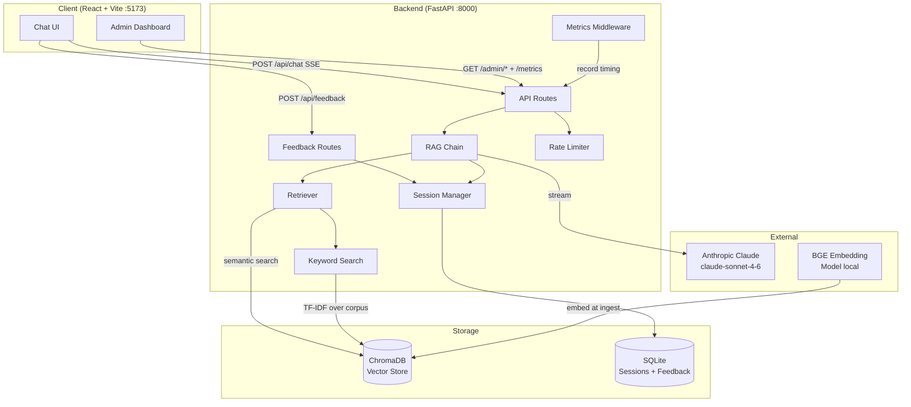

# Architecture — SGHR Chatbot

> Last updated: 2026-03-20 | Updated by: Claude Code

## System Overview
SGHR Chatbot is a RAG-powered HR assistant that answers questions about the Singapore Employment Act and MOM guidelines. It serves employees and HR managers via a React chat interface, streaming responses from Claude through a FastAPI backend backed by ChromaDB vector search.

## Architecture Diagram


## Component Map

| Component | Location | Responsibility | Dependencies |
|-----------|----------|----------------|--------------|
| API Routes - Chat | `backend/api/routes_chat.py` | POST /api/chat (SSE), session history, session delete | rag_chain, session_manager, limiter |
| API Routes - Admin | `backend/api/routes_admin.py` | Admin/ingestion triggers, health checks, collection counts, escalations list | ingestion pipeline, session_manager, limiter |
| API Routes - Feedback | `backend/api/routes_feedback.py` | POST /api/feedback, GET /admin/feedback, GET /admin/feedback/stats | session_manager |
| RAG Chain | `backend/chat/rag_chain.py` | Retrieve → prompt → stream Claude response (with budget-aware context) | retriever, session_manager, context_manager, token_budget, prompts, Anthropic SDK |
| Token Budget | `backend/chat/token_budget.py` | Token counting (Anthropic API + tiktoken fallback), budget allocation | anthropic, tiktoken |
| Context Manager | `backend/chat/context_manager.py` | SummaryBuffer: compresses older history via Haiku, extracts session facts | session_manager, token_budget, Anthropic SDK (Haiku) |
| Session Manager | `backend/chat/session_manager.py` | CRUD for conversation history + feedback + escalations + summary + facts, TTL cleanup | aiosqlite, SQLite |
| Tool Registry | `backend/chat/tools/registry.py` | Tool schema definitions (Anthropic format), dispatch map, handler registration | — |
| Retrieval Tools | `backend/chat/tools/retrieval_tools.py` | search_employment_act, search_mom_guidelines, search_all_policies, get_legal_definitions | retriever, prompts |
| Calculation Tools | `backend/chat/tools/calculation_tools.py` | calculate_leave_entitlement (annual/sick/maternity/paternity/childcare), calculate_notice_period | — |
| Routing Tools | `backend/chat/tools/routing_tools.py` | check_eligibility (EA Part IV thresholds), escalate_to_hr (SQLite log) | session_manager |
| Prompts | `backend/chat/prompts.py` | System prompt builder, context formatter, source extractor | — |
| Retriever | `backend/retrieval/retriever.py` | Hybrid retrieval (semantic + keyword RRF) + definitions injection + per-collection search | vector_store, keyword_search |
| Keyword Search | `backend/retrieval/keyword_search.py` | TF-IDF over ChromaDB corpus, lazy singleton, RRF input | scikit-learn |
| Vector Store | `backend/retrieval/vector_store.py` | ChromaDB wrapper (collections, readiness check, bulk fetch, metadata filtering) | chromadb |
| Ingest Pipeline | `backend/ingestion/ingest_pipeline.py` | Orchestrates scrape → chunk → embed → store | scraper, chunker, embedder |
| Embedder | `backend/ingestion/embedder.py` | BGE model wrapper, lazy singleton | sentence-transformers |
| Chunker | `backend/ingestion/chunker.py` | Text splitting with overlap | — |
| Scrapers | `backend/ingestion/scraper_*.py` | Fetch Employment Act PDF and MOM web pages | playwright, pdfminer, bs4 |
| Config | `backend/config.py` | Pydantic settings, reads `.env` | pydantic-settings |
| Logger | `backend/lib/logger.py` | Structured JSON logger factory | Python logging |
| Limiter | `backend/lib/limiter.py` | Shared slowapi rate-limiter singleton (avoids circular imports) | slowapi |
| Metrics | `backend/lib/metrics.py` | In-memory request counter: totals, errors, avg latency, per-path counts | threading.Lock |
| Frontend App | `frontend/src/` | React chat interface, SSE streaming, feedback buttons, admin dashboard | React 19, Vite |

## Data Model

### Core Entities

| Entity | Storage | Key Fields | Relationships |
|--------|---------|------------|---------------|
| Session | SQLite `sessions` | session_id, user_id, summary, session_facts_json, created_at, last_active | Has many Messages, Has many Feedback |
| Message | SQLite `messages` | id, session_id, role, content, created_at | Belongs to Session |
| Feedback | SQLite `feedback` | id, session_id, message_index, rating (up/down), comment, created_at | Belongs to Session |
| Escalation | SQLite `escalations` | id, session_id, reason, status (pending/reviewed/resolved), created_at | Belongs to Session |
| Document Chunk | ChromaDB | id, text, metadata (source, section, page) | — |

### Schema Notes
- Sessions expire after `SESSION_TTL_HOURS` (default 2h); background cleanup loop runs every 1 hour
- Feedback is tied to `session_id` + `message_index`; cascades on session delete
- ChromaDB uses two collections: `employment_act` (PDF) and `mom_guidelines` (web)
- BGE embeddings are 768-dimensional

## API Endpoints

| Method | Path | Description | Auth | Rate Limit | Status |
|--------|------|-------------|------|------------|--------|
| GET | `/health` | System health (model loaded, chroma ready) | No | — | ✅ |
| GET | `/metrics` | In-memory request metrics + feedback stats | No | — | ✅ |
| POST | `/api/chat` | Stream RAG response (SSE) | No | 20/min per IP | ✅ |
| GET | `/api/sessions/{session_id}/history` | Fetch conversation history | No | — | ✅ |
| DELETE | `/api/sessions/{session_id}` | Delete session | No | — | ✅ |
| POST | `/api/feedback` | Record thumbs-up/down on an assistant message | No | — | ✅ |
| POST | `/admin/ingest` | Trigger ingestion pipeline in background | No | 10/min per IP | ✅ |
| GET | `/admin/health/sources` | Validate MOM seed URLs are reachable | No | 10/min per IP | ✅ |
| GET | `/admin/collections` | Return ChromaDB document counts | No | 10/min per IP | ✅ |
| GET | `/admin/feedback` | Paginated list of feedback records | No | — | ✅ |
| GET | `/admin/feedback/stats` | Aggregate up/down counts | No | — | ✅ |
| GET | `/admin/escalations` | Paginated list of escalation records (filterable by status) | No | 10/min per IP | ✅ |

## External Integrations

| Service | Purpose | Config | Rate Limits | Error Handling |
|---------|---------|--------|-------------|----------------|
| Anthropic Claude | Generate HR answers | `ANTHROPIC_API_KEY` in `.env` | Per plan | Catches `APIError`, streams error token to client |
| ChromaDB | Vector similarity search | Local dir `backend/data/chroma_db/` | Local — no limits | `is_ready()` check at startup |
| BGE Model | Text embeddings | Local cache via sentence-transformers | Local — no limits | Lazy-loaded singleton, warning if missing |

## Error Handling Strategy

### Error Flow
```
Client Error  -> FastAPI validation -> 422 JSON response
Rate Limit    -> slowapi -> 429 JSON with Retry-After header
API Error     -> try/except in rag_chain -> SSE error event to client
Claude Error  -> anthropic.APIError caught -> error SSE token
Service Error -> log.error() -> propagate or fallback message
Zero results  -> FALLBACK_MESSAGE streamed + session still saved
```

### API Error Response Format (non-streaming)
```json
{ "detail": "Human-readable description" }
```
### SSE Error Format (streaming)
```json
{ "error": "Human-readable description", "done": true, "sources": [] }
```

## Security

### Secret Management
- All secrets in `.env` (never committed)
- `.env.example` maintained with placeholders for all required vars
- Secrets loaded only via `backend/config.py` (pydantic-settings)
- Pre-commit scan pattern: `sk-ant-` (CLAUDE.md Rule 1)

### Input Validation
- All API inputs validated via Pydantic models (`ChatRequest`, `FeedbackRequest`)
- `user_role` constrained to `"employee"` | `"hr"` (prompt logic)
- `rating` constrained to `"up"` | `"down"` (DB CHECK constraint + Pydantic validator)
- Session IDs are UUIDs generated client-side

### Rate Limiting
- `/api/chat` limited to 20 requests/minute per IP (configurable via `CHAT_RATE_LIMIT`)
- `/admin/*` limited to 10 requests/minute per IP (configurable via `ADMIN_RATE_LIMIT`)
- Returns 429 with `Retry-After` header on excess

### Deployment Security
- CORS restricted to `http://localhost:5173` in dev
- No auth currently — add before any public deployment
- `.env` in `.gitignore`; only `.env.example` committed

## Feature Log

| Feature | Date | Key Decisions | Files Changed |
|---------|------|---------------|---------------|
| Initial Release | 2026-03-15 | RAG with ChromaDB + BGE; SSE streaming; SQLite sessions; dual-role prompts (employee/hr); Section 2 definitions injection | All initial files |
| Best-Practice Setup | 2026-03-15 | Added CLAUDE.md, ARCHITECTURE.md, settings.json, brand docs, structured logger | `CLAUDE.md`, `ARCHITECTURE.md`, `.claude/settings.json`, `docs/brand/`, `backend/lib/logger.py`, `.env.example` |
| Enhancements V2 (Features 3–7) | 2026-03-16 | User feedback (thumbs up/down → SQLite); slowapi rate limiting (20/min chat, 10/min admin); hybrid retrieval with TF-IDF + RRF; in-memory metrics middleware; admin dashboard UI with 4 tabs | `session_manager.py`, `routes_feedback.py`, `routes_chat.py`, `routes_admin.py`, `main.py`, `config.py`, `keyword_search.py`, `retriever.py`, `vector_store.py`, `lib/limiter.py`, `lib/metrics.py`, `MessageBubble.jsx`, `ChatWindow.jsx`, `App.jsx`, `useChat.js`, `chatApi.js`, `adminApi.js`, `AdminDashboard.jsx`, `index.css`, `requirements.txt` |
| Enhancing Chatbot Phase 1 | 2026-03-20 | Persistent anonymous user_id (localStorage); token budget manager (Anthropic count_tokens API + tiktoken fallback, 40/60 history/context split); SummaryBuffer context manager (Haiku summarization, fact extraction, system prompt injection); CI: CPU-only PyTorch, conftest mock for SentenceTransformer | `token_budget.py`, `context_manager.py`, `session_manager.py`, `rag_chain.py`, `routes_chat.py`, `config.py`, `useChat.js`, `chatApi.js`, `requirements.txt`, `ci.yml`, `conftest.py` |
| Enhancing Chatbot Phase 2 — Tools | 2026-03-20 | Tool registry with 8 Anthropic-format tool schemas and async dispatch; 4 retrieval tools (per-collection search, definitions lookup); 2 calculation tools (leave entitlement with EA s43/s89/Part IX, notice period with EA s10); 2 routing tools (EA eligibility check with salary thresholds, HR escalation to SQLite); metadata filtering via ChromaDB where-clauses; escalations table + admin endpoint | `tools/registry.py`, `tools/retrieval_tools.py`, `tools/calculation_tools.py`, `tools/routing_tools.py`, `retriever.py`, `vector_store.py`, `session_manager.py`, `routes_admin.py` |

> Add a row after completing each feature.

---
_Maintained by Claude Code per CLAUDE.md Rule 4._
