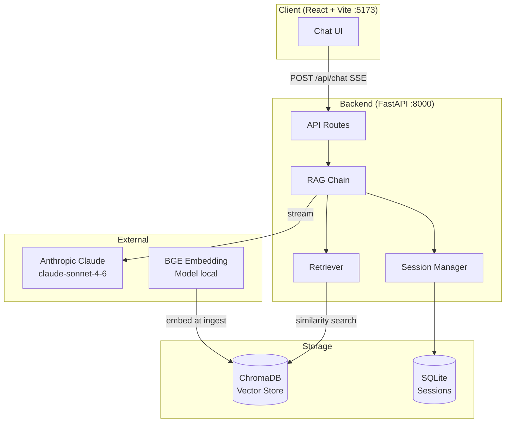

# Architecture — SGHR Chatbot

> Last updated: 2026-03-15 | Updated by: Claude Code

## System Overview
SGHR Chatbot is a RAG-powered HR assistant that answers questions about the Singapore Employment Act and MOM guidelines. It serves employees and HR managers via a React chat interface, streaming responses from Claude through a FastAPI backend backed by ChromaDB vector search.

## Architecture Diagram


## Component Map

| Component | Location | Responsibility | Dependencies |
|-----------|----------|----------------|--------------|
| API Routes - Chat | `backend/api/routes_chat.py` | POST /api/chat (SSE), session history, session delete | rag_chain, session_manager |
| API Routes - Admin | `backend/api/routes_admin.py` | Admin/ingestion triggers | ingestion pipeline |
| RAG Chain | `backend/chat/rag_chain.py` | Retrieve → prompt → stream Claude response | retriever, session_manager, prompts, Anthropic SDK |
| Session Manager | `backend/chat/session_manager.py` | CRUD for conversation history, TTL cleanup | aiosqlite, SQLite |
| Prompts | `backend/chat/prompts.py` | System prompt builder, context formatter, source extractor | — |
| Retriever | `backend/retrieval/retriever.py` | Hybrid retrieval + definitions injection | vector_store |
| Vector Store | `backend/retrieval/vector_store.py` | ChromaDB wrapper (collections, readiness check) | chromadb |
| Ingest Pipeline | `backend/ingestion/ingest_pipeline.py` | Orchestrates scrape → chunk → embed → store | scraper, chunker, embedder |
| Embedder | `backend/ingestion/embedder.py` | BGE model wrapper, lazy singleton | sentence-transformers |
| Chunker | `backend/ingestion/chunker.py` | Text splitting with overlap | — |
| Scrapers | `backend/ingestion/scraper_*.py` | Fetch Employment Act PDF and MOM web pages | playwright, pdfminer, bs4 |
| Config | `backend/config.py` | Pydantic settings, reads `.env` | pydantic-settings |
| Logger | `backend/lib/logger.py` | Structured JSON logger factory | Python logging |
| Frontend App | `frontend/src/` | React chat interface, SSE streaming | React 19, Vite |

## Data Model

### Core Entities

| Entity | Storage | Key Fields | Relationships |
|--------|---------|------------|---------------|
| Session | SQLite `sessions` | session_id, created_at, last_active | Has many Messages |
| Message | SQLite `messages` | id, session_id, role, content, created_at | Belongs to Session |
| Document Chunk | ChromaDB | id, text, metadata (source, section, page) | — |

### Schema Notes
- Sessions expire after `SESSION_TTL_HOURS` (default 2h); background cleanup loop runs every 10 min
- ChromaDB uses two collections: `employment_act` (PDF) and `mom_guidelines` (web)
- BGE embeddings are 768-dimensional

## API Endpoints

| Method | Path | Description | Auth | Status |
|--------|------|-------------|------|--------|
| GET | `/health` | System health (model loaded, chroma ready) | No | ✅ |
| POST | `/api/chat` | Stream RAG response (SSE) | No | ✅ |
| GET | `/api/sessions/{session_id}/history` | Fetch conversation history | No | ✅ |
| DELETE | `/api/sessions/{session_id}` | Delete session | No | ✅ |

## External Integrations

| Service | Purpose | Config | Rate Limits | Error Handling |
|---------|---------|--------|-------------|----------------|
| Anthropic Claude | Generate HR answers | `ANTHROPIC_API_KEY` in `.env` | Per plan | Catches `APIError`, streams error token to client |
| ChromaDB | Vector similarity search | Local dir `backend/data/chroma_db/` | Local — no limits | `is_ready()` check at startup |
| BGE Model | Text embeddings | Local cache via sentence-transformers | Local — no limits | Lazy-loaded singleton, warning if missing |

## Error Handling Strategy

### Error Flow
```
Client Error  -> FastAPI validation -> 422 JSON response
API Error     -> try/except in rag_chain -> SSE error event to client
Claude Error  -> anthropic.APIError caught -> error SSE token
Service Error -> log.error() -> propagate or fallback message
Zero results  -> FALLBACK_MESSAGE streamed + session still saved
```

### API Error Response Format (non-streaming)
```json
{ "detail": "Human-readable description" }
```
### SSE Error Format (streaming)
```json
{ "error": "Human-readable description", "done": true, "sources": [] }
```

## Security

### Secret Management
- All secrets in `.env` (never committed)
- `.env.example` maintained with placeholders for all required vars
- Secrets loaded only via `backend/config.py` (pydantic-settings)
- Pre-commit scan pattern: `sk-ant-` (CLAUDE.md Rule 1)

### Input Validation
- All API inputs validated via Pydantic models (`ChatRequest`)
- `user_role` constrained to `"employee"` | `"hr"` (prompt logic)
- Session IDs are UUIDs generated client-side

### Deployment Security
- CORS restricted to `http://localhost:5173` in dev
- No auth currently — add before any public deployment
- `.env` in `.gitignore`; only `.env.example` committed

## Feature Log

| Feature | Date | Key Decisions | Files Changed |
|---------|------|---------------|---------------|
| Initial Release | 2026-03-15 | RAG with ChromaDB + BGE; SSE streaming; SQLite sessions; dual-role prompts (employee/hr); Section 2 definitions injection | All initial files |
| Best-Practice Setup | 2026-03-15 | Added CLAUDE.md, ARCHITECTURE.md, settings.json, brand docs, structured logger | `CLAUDE.md`, `ARCHITECTURE.md`, `.claude/settings.json`, `docs/brand/`, `backend/lib/logger.py`, `.env.example` |

> Add a row after completing each feature.

---
_Maintained by Claude Code per CLAUDE.md Rule 4._
