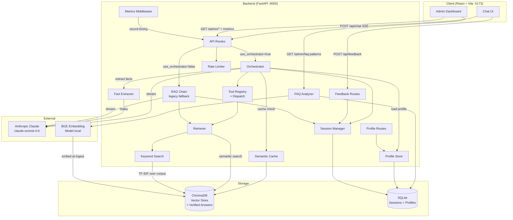

# Architecture — SGHR Chatbot

> Last updated: 2026-03-25 (Testing Improvements Track 2) | Updated by: Claude Code

## System Overview
SGHR Chatbot is a RAG-powered HR assistant that answers questions about the Singapore Employment Act and MOM guidelines. It serves employees and HR managers via a React chat interface, streaming responses from Claude through a FastAPI backend backed by ChromaDB vector search.

## Architecture Diagram


## Component Map

| Component | Location | Responsibility | Dependencies |
|-----------|----------|----------------|--------------|
| API Routes - Chat | `backend/api/routes_chat.py` | POST /api/chat (SSE), session history, session delete | orchestrator, rag_chain, session_manager, limiter |
| Orchestrator | `backend/chat/orchestrator.py` | Agentic tool-use loop: streams Claude response, detects tool_use, dispatches tools, emits status/token/done SSE events; semantic cache check before loop; profile injection into system prompt; async profile update after response | tool registry, session_manager, context_manager, token_budget, prompts, profile_store, fact_extractor, semantic_cache, Anthropic SDK |
| API Routes - Admin | `backend/api/routes_admin.py` | Admin/ingestion triggers, health checks, collection counts, escalations list, verified answers CRUD, feedback candidates | ingestion pipeline, session_manager, semantic_cache, limiter |
| API Routes - Feedback | `backend/api/routes_feedback.py` | POST /api/feedback, GET /admin/feedback, GET /admin/feedback/stats | session_manager |
| API Routes - Profile | `backend/api/routes_profile.py` | GET /api/profile/{user_id}, DELETE /api/profile/{user_id} (privacy) | profile_store |
| Profile Store | `backend/memory/profile_store.py` | SQLite CRUD for user employment profiles; merge-without-overwrite upsert; stale cleanup | aiosqlite |
| Fact Extractor | `backend/memory/fact_extractor.py` | Haiku-based extraction of employment facts from conversation | Anthropic SDK (Haiku) |
| Semantic Cache | `backend/memory/semantic_cache.py` | Verified Q&A cache in ChromaDB; two-tier similarity matching (high/medium); add/remove/list | vector_store, embedder |
| FAQ Analyzer | `backend/memory/faq_analyzer.py` | Clusters user queries by embedding similarity (DBSCAN); surfaces top question patterns and knowledge gaps (thumbs-down + escalations) for admin review | aiosqlite, embedder, scikit-learn |
| RAG Chain (legacy) | `backend/chat/rag_chain.py` | Legacy pipeline: retrieve → prompt → stream Claude response (fallback when use_orchestrator=False) | retriever, session_manager, context_manager, token_budget, prompts, Anthropic SDK |
| Token Budget | `backend/chat/token_budget.py` | Token counting (Anthropic API + tiktoken fallback), budget allocation | anthropic, tiktoken |
| Context Manager | `backend/chat/context_manager.py` | SummaryBuffer: compresses older history via Haiku, extracts session facts | session_manager, token_budget, Anthropic SDK (Haiku) |
| Session Manager | `backend/chat/session_manager.py` | CRUD for conversation history + feedback + escalations + summary + facts, TTL cleanup | aiosqlite, SQLite |
| Tool Registry | `backend/chat/tools/registry.py` | Tool schema definitions (Anthropic format), dispatch map, handler registration | — |
| Retrieval Tools | `backend/chat/tools/retrieval_tools.py` | search_employment_act, search_mom_guidelines, search_all_policies, get_legal_definitions; enhanced retrieval pipeline (expand → retrieve_multi → compress) | retriever, query_expander, compressor, prompts |
| Calculation Tools | `backend/chat/tools/calculation_tools.py` | calculate_leave_entitlement (annual/sick/maternity/paternity/childcare), calculate_notice_period | — |
| Routing Tools | `backend/chat/tools/routing_tools.py` | check_eligibility (EA Part IV thresholds), escalate_to_hr (SQLite log) | session_manager |
| Prompts | `backend/chat/prompts.py` | System prompt builder, context formatter, source extractor | — |
| Retriever | `backend/retrieval/retriever.py` | Hybrid retrieval (semantic + keyword RRF) + definitions injection + per-collection search + multi-query retrieval with generalized N-list RRF | vector_store, keyword_search, embedder |
| Query Expander | `backend/retrieval/query_expander.py` | Haiku-based query expansion; generates 2-3 HR synonym rephrasings; best-effort (returns original on failure) | Anthropic SDK (Haiku) |
| Compressor | `backend/retrieval/compressor.py` | Contextual compression; filters chunks by cosine similarity to query using stored ChromaDB embeddings; replaces _apply_threshold when enabled | — |
| Keyword Search | `backend/retrieval/keyword_search.py` | TF-IDF over ChromaDB corpus, lazy singleton, RRF input | scikit-learn |
| Vector Store | `backend/retrieval/vector_store.py` | ChromaDB wrapper (collections, readiness check, bulk fetch, metadata filtering, optional embedding return) | chromadb |
| Ingest Pipeline | `backend/ingestion/ingest_pipeline.py` | Orchestrates scrape → chunk → embed → store | scraper, chunker, embedder |
| Embedder | `backend/ingestion/embedder.py` | BGE model wrapper, lazy singleton | sentence-transformers |
| Chunker | `backend/ingestion/chunker.py` | Text splitting with overlap | — |
| Scrapers | `backend/ingestion/scraper_*.py` | Fetch Employment Act PDF and MOM web pages | playwright, pdfminer, bs4 |
| Config | `backend/config.py` | Pydantic settings, reads `.env`; environment-aware (dev/staging/prod) | pydantic-settings |
| Logger | `backend/lib/logger.py` | Structured JSON logger factory | Python logging |
| Session Signer | `backend/lib/session_signer.py` | HMAC-SHA256 session ID signing/verification; grace period for unsigned legacy IDs | config |
| Admin Auth | `backend/lib/admin_auth.py` | FastAPI dependency: validates `X-Admin-Key` header; audit logging on success | config, logger |
| Limiter | `backend/lib/limiter.py` | Shared slowapi rate-limiter; composite key (X-Session-Token header → IP fallback) | slowapi |
| Metrics | `backend/lib/metrics.py` | In-memory request counter: totals, errors, avg latency, per-path counts | threading.Lock |
| Frontend App | `frontend/src/` | React chat interface, SSE streaming, feedback buttons, admin dashboard | React 19, Vite |
| E2E Tests | `tests/e2e/` | Full request/response cycle tests with mocked Claude API, real SQLite + ChromaDB | httpx, pytest-asyncio |
| Orchestrator Integration Tests | `tests/chat/test_orchestrator_integration.py` | Tool dispatch loop tests with real registry, mocked Claude + dependencies | pytest |
| Load Tests | `tests/load/locustfile.py` | HTTP load simulation (ChatUser, AdminUser, FeedbackUser); requires `MOCK_LLM=true` | Locust |
| Frontend Tests | `frontend/src/__tests__/` | Component smoke tests (InputBar, MessageBubble, AdminDashboard) | Vitest, React Testing Library |

## Data Model

### Core Entities

| Entity | Storage | Key Fields | Relationships |
|--------|---------|------------|---------------|
| Session | SQLite `sessions` | session_id, user_id, summary, session_facts_json, created_at, last_active | Has many Messages, Has many Feedback |
| Message | SQLite `messages` | id, session_id, role, content, created_at | Belongs to Session |
| Feedback | SQLite `feedback` | id, session_id, message_index, rating (up/down), comment, created_at | Belongs to Session |
| Escalation | SQLite `escalations` | id, session_id, reason, status (pending/reviewed/resolved), created_at | Belongs to Session |
| User Profile | SQLite `user_profiles` | user_id (PK), employment_type, salary_bracket, tenure_years, company, topics_json, preferences_json, created_at, updated_at | — |
| Document Chunk | ChromaDB | id, text, metadata (source, section, page) | — |
| Verified Answer | ChromaDB `verified_answers` | id, document (answer), metadata (question, sources JSON) | — |

### Schema Notes
- Sessions expire after `SESSION_TTL_HOURS` (default 2h); background cleanup loop runs every 1 hour
- Feedback is tied to `session_id` + `message_index`; cascades on session delete
- User profiles auto-deleted after 2 years inactive (`PROFILE_RETENTION_YEARS`)
- ChromaDB uses three collections: `employment_act` (PDF), `mom_guidelines` (web), `verified_answers` (cache)
- BGE embeddings are 768-dimensional
- Semantic cache uses two-tier thresholds: high (>= 0.95) and medium (>= 0.88), configurable via `.env`

## API Endpoints

| Method | Path | Description | Auth | Rate Limit | Status |
|--------|------|-------------|------|------------|--------|
| GET | `/health` | System health (model loaded, chroma ready) | None | — | ✅ |
| GET | `/metrics` | In-memory request metrics + feedback stats | Admin key | — | ✅ |
| POST | `/api/chat` | Stream RAG response (SSE); returns signed_session_id | Signed session (or null for new) | 20/min per session/IP | ✅ |
| GET | `/api/sessions/{session_id}/history` | Fetch conversation history | Signed session (X-Session-Token) | — | ✅ |
| DELETE | `/api/sessions/{session_id}` | Delete session | Signed session (X-Session-Token) | — | ✅ |
| POST | `/api/feedback` | Record thumbs-up/down; validates session exists | Session exists | 5/min per session/IP | ✅ |
| POST | `/admin/ingest` | Trigger ingestion pipeline in background | Admin key | 10/min per session/IP | ✅ |
| GET | `/admin/health/sources` | Validate MOM seed URLs are reachable | Admin key | 10/min per session/IP | ✅ |
| GET | `/admin/collections` | Return ChromaDB document counts | Admin key | 10/min per session/IP | ✅ |
| GET | `/admin/feedback` | Paginated list of feedback records | Admin key | — | ✅ |
| GET | `/admin/feedback/stats` | Aggregate up/down counts | Admin key | — | ✅ |
| GET | `/admin/escalations` | Paginated list of escalation records | Admin key | 10/min per session/IP | ✅ |
| GET | `/api/profile/{user_id}` | Return user profile data | Signed session or admin key | 10/min per session/IP | ✅ |
| DELETE | `/api/profile/{user_id}` | Delete user profile (privacy compliance) | Admin key only | 10/min per session/IP | ✅ |
| GET | `/admin/verified-answers` | List all cached verified answers | Admin key | 10/min per session/IP | ✅ |
| POST | `/admin/verified-answers` | Add verified answer to semantic cache | Admin key | 10/min per session/IP | ✅ |
| DELETE | `/admin/verified-answers/{id}` | Remove verified answer from cache | Admin key | 10/min per session/IP | ✅ |
| GET | `/admin/feedback/candidates` | Thumbs-up answers not yet in cache | Admin key | 10/min per session/IP | ✅ |
| GET | `/admin/faq-patterns` | Top query clusters + knowledge gaps (days param) | Admin key | 10/min per session/IP | ✅ |

## External Integrations

| Service | Purpose | Config | Rate Limits | Error Handling |
|---------|---------|--------|-------------|----------------|
| Anthropic Claude | Generate HR answers | `ANTHROPIC_API_KEY` in `.env` | Per plan | Catches `APIError`, streams error token to client |
| ChromaDB | Vector similarity search | Local dir `backend/data/chroma_db/` | Local — no limits | `is_ready()` check at startup |
| BGE Model | Text embeddings | Local cache via sentence-transformers | Local — no limits | Lazy-loaded singleton, warning if missing |

## Error Handling Strategy

### Error Flow
```
Client Error  -> FastAPI validation -> 422 JSON response
Rate Limit    -> slowapi -> 429 JSON with Retry-After header
API Error     -> try/except in orchestrator/rag_chain -> SSE error event to client
Claude Error  -> anthropic.APIError caught -> error SSE token
Tool Error    -> caught in orchestrator -> error result sent back to Claude
Service Error -> log.error() -> propagate or fallback message
Zero results  -> FALLBACK_MESSAGE streamed + session still saved
Max iterations -> FALLBACK_MAX_ITERATIONS streamed after 5 tool loops
```

### API Error Response Format (non-streaming)
```json
{ "detail": "Human-readable description" }
```
### SSE Event Formats (streaming)
```json
{ "token": "text chunk", "done": false }
{ "status": "thinking", "detail": "Searching Employment Act..." }
{ "token": "", "done": true, "sources": [{"label": "...", "url": "..."}], "signed_session_id": "uuid.sig" }
{ "error": "Human-readable description", "done": true, "sources": [] }
```

## Security

### Authentication
- **Admin endpoints** (`/admin/*`, `/metrics`): Protected by `X-Admin-Key` header, validated against `ADMIN_API_KEY` env var. Default `dev-only-key` for development. Audit logging on successful access.
- **Session signing**: Server generates session IDs and signs them with HMAC-SHA256 (`SESSION_SECRET_KEY`). Clients store the signed token and send it as `X-Session-Token` header. Grace period: unsigned legacy IDs accepted when `SESSION_SIGNING_ENFORCED=false`.
- **Profile access**: GET requires valid session or admin key. DELETE requires admin key only.
- **Feedback**: Validates session exists before accepting feedback.
- **Known limitation**: No real user authentication. Per-session rate limiting can be bypassed by creating new sessions. To be addressed in a future auth feature.

### Secret Management
- All secrets in `.env` (never committed)
- `.env.example` maintained with placeholders for all required vars
- Secrets loaded only via `backend/config.py` (pydantic-settings)
- Pre-commit scan pattern: `sk-ant-` (CLAUDE.md Rule 1)

### Input Validation
- All API inputs validated via Pydantic models (`ChatRequest`, `FeedbackRequest`)
- `user_role` constrained to `"employee"` | `"hr"` (prompt logic)
- `rating` constrained to `"up"` | `"down"` (DB CHECK constraint + Pydantic validator)
- Session IDs are server-generated UUIDs, HMAC-signed

### Rate Limiting
- `/api/chat` limited to 20/min per session/IP (configurable via `CHAT_RATE_LIMIT`)
- `/admin/*` limited to 10/min per session/IP (configurable via `ADMIN_RATE_LIMIT`)
- `/api/feedback` limited to 5/min per session/IP (configurable via `FEEDBACK_RATE_LIMIT`)
- `/api/profile/*` limited to 10/min per session/IP (configurable via `PROFILE_RATE_LIMIT`)
- Composite key: `X-Session-Token` header → client IP fallback
- Returns 429 with `Retry-After` header on excess

### Deployment Security
- CORS from env: `ALLOWED_ORIGINS` (comma-separated), defaults to `http://localhost:5173`
- `ENFORCE_HTTPS=true` enables HTTPSRedirectMiddleware for production
- `ENVIRONMENT` env var (`dev`/`staging`/`prod`) for environment-specific behaviour
- `.env` in `.gitignore`; only `.env.example` committed

## Feature Log

| Feature | Date | Key Decisions | Files Changed |
|---------|------|---------------|---------------|
| Initial Release | 2026-03-15 | RAG with ChromaDB + BGE; SSE streaming; SQLite sessions; dual-role prompts (employee/hr); Section 2 definitions injection | All initial files |
| Best-Practice Setup | 2026-03-15 | Added CLAUDE.md, ARCHITECTURE.md, settings.json, brand docs, structured logger | `CLAUDE.md`, `ARCHITECTURE.md`, `.claude/settings.json`, `docs/brand/`, `backend/lib/logger.py`, `.env.example` |
| Enhancements V2 (Features 3–7) | 2026-03-16 | User feedback (thumbs up/down → SQLite); slowapi rate limiting (20/min chat, 10/min admin); hybrid retrieval with TF-IDF + RRF; in-memory metrics middleware; admin dashboard UI with 4 tabs | `session_manager.py`, `routes_feedback.py`, `routes_chat.py`, `routes_admin.py`, `main.py`, `config.py`, `keyword_search.py`, `retriever.py`, `vector_store.py`, `lib/limiter.py`, `lib/metrics.py`, `MessageBubble.jsx`, `ChatWindow.jsx`, `App.jsx`, `useChat.js`, `chatApi.js`, `adminApi.js`, `AdminDashboard.jsx`, `index.css`, `requirements.txt` |
| Enhancing Chatbot Phase 1 | 2026-03-20 | Persistent anonymous user_id (localStorage); token budget manager (Anthropic count_tokens API + tiktoken fallback, 40/60 history/context split); SummaryBuffer context manager (Haiku summarization, fact extraction, system prompt injection); CI: CPU-only PyTorch, conftest mock for SentenceTransformer | `token_budget.py`, `context_manager.py`, `session_manager.py`, `rag_chain.py`, `routes_chat.py`, `config.py`, `useChat.js`, `chatApi.js`, `requirements.txt`, `ci.yml`, `conftest.py` |
| Enhancing Chatbot Phase 2 — Tools | 2026-03-20 | Tool registry with 8 Anthropic-format tool schemas and async dispatch; 4 retrieval tools (per-collection search, definitions lookup); 2 calculation tools (leave entitlement with EA s43/s89/Part IX, notice period with EA s10); 2 routing tools (EA eligibility check with salary thresholds, HR escalation to SQLite); metadata filtering via ChromaDB where-clauses; escalations table + admin endpoint | `tools/registry.py`, `tools/retrieval_tools.py`, `tools/calculation_tools.py`, `tools/routing_tools.py`, `retriever.py`, `vector_store.py`, `session_manager.py`, `routes_admin.py` |
| Enhancing Chatbot Phase 2 — Orchestrator | 2026-03-21 | Agentic tool-use loop replaces static RAG pipeline; streaming throughout all iterations (no double API call); status SSE events for tool dispatch; source extraction from tool results; max 5 iterations with graceful fallback; feature flag (use_orchestrator) for legacy fallback; simplified system prompt for tool-use mode; frontend thinking steps UI | `orchestrator.py`, `prompts.py`, `routes_chat.py`, `config.py`, `chatApi.js`, `useChat.js`, `MessageBubble.jsx`, `index.css` |
| Enhancing Chatbot Phase 3 — Profile & Cache | 2026-03-21 | Profile memory store (SQLite user_profiles, Haiku fact extraction, merge-without-overwrite upsert, 2yr stale cleanup); Verified Q&A semantic cache (ChromaDB verified_answers collection, two-tier confidence matching at 0.95/0.88, cache hit skips Claude API, medium-confidence disclaimer); profile routes (GET/DELETE for privacy compliance); admin verified answers CRUD + feedback candidates endpoint; frontend Verified Answers admin tab | `memory/profile_store.py`, `memory/fact_extractor.py`, `memory/semantic_cache.py`, `api/routes_profile.py`, `api/routes_admin.py`, `chat/orchestrator.py`, `config.py`, `main.py`, `adminApi.js`, `AdminDashboard.jsx` |
| Enhancing Chatbot Phase 3 — FAQ Patterns | 2026-03-21 | FAQ analyzer using DBSCAN clustering on BGE embeddings (eps=0.3, cosine metric); two analysis modes: top query patterns (frequent clusters) and knowledge gaps (thumbs-down + escalation clusters); capped at 500 most recent queries; admin endpoint GET /admin/faq-patterns with days parameter; frontend FAQ Patterns tab with days selector and expandable sample queries | `memory/faq_analyzer.py`, `api/routes_admin.py`, `adminApi.js`, `AdminDashboard.jsx` |
| Enhancing Chatbot Phase 4A/4B — Retrieval Quality | 2026-03-22 | Query expansion via Haiku (2-3 HR synonym rephrasings per query, best-effort); generalized N-list RRF with id-based dedup (replaces text[:100] key); parallel multi-query retrieval via ThreadPoolExecutor; contextual compression using stored ChromaDB embeddings + cosine similarity filtering (replaces _apply_threshold when enabled); both features independently toggleable via config; vector_store returns optional embeddings | `retrieval/query_expander.py`, `retrieval/compressor.py`, `retrieval/retriever.py`, `retrieval/vector_store.py`, `chat/tools/retrieval_tools.py`, `config.py`, `.env.example` |
| Retrieval Quality Tuning | 2026-03-22 | Moved hardcoded retriever constants (THRESHOLD_FLOOR, THRESHOLD_MULTIPLIER, RRF_K, MAX_RESULTS) to config.py for env-based tuning; two-stage parameter sweep script (Stage 1: 45 configs expansion OFF, Stage 2: top-5 with expansion ON at 3 expansion counts) | `config.py`, `retrieval/retriever.py`, `.env.example`, `tests/eval/sweep.py` |
| Testing Improvements | 2026-03-22 | Auth unit tests (session signer + admin auth); orchestrator integration tests (14 tests: single/multi tool dispatch, max iterations fallback, tool error recovery, semantic cache hit); load testing setup with Locust (SSE stream consumption, admin read storms, feedback bursts); retrieval quality eval framework (55 labelled queries, keyword recall + adversarial detection, per-category breakdown, configurable expansion/compression flags) | `tests/lib/test_session_signer.py`, `tests/lib/test_admin_auth.py`, `tests/chat/test_orchestrator_integration.py`, `tests/load/locustfile.py`, `tests/load/README.md`, `tests/requirements-load.txt`, `tests/eval/dataset.json`, `tests/eval/eval_retrieval.py`, `tests/eval/README.md` |
| Auth & Deployment Hardening | 2026-03-22 | HMAC-SHA256 session signing (server generates IDs, grace period for legacy); admin API key auth for /admin/* + /metrics with audit logging; env-based CORS (ALLOWED_ORIGINS); per-session rate limiting via X-Session-Token header; profile access control (session or admin for GET, admin-only for DELETE); feedback session validation; HTTPS redirect middleware (ENFORCE_HTTPS); ENVIRONMENT config (dev/staging/prod); rate limits on feedback + profile endpoints | `lib/session_signer.py`, `lib/admin_auth.py`, `lib/limiter.py`, `config.py`, `main.py`, `api/routes_chat.py`, `api/routes_admin.py`, `api/routes_feedback.py`, `api/routes_profile.py`, `adminApi.js`, `chatApi.js`, `useChat.js`, `AdminDashboard.jsx`, `.env.example` |
| Testing Improvements Track 2 | 2026-03-25 | 27 E2E tests (httpx AsyncClient, mocked Claude, real SQLite); orchestrator integration expanded with multi-turn, tool chaining, fallback, error recovery (23 total); mock LLM mode (MOCK_LLM env var) for load testing; Locust validation + baseline doc; frontend test setup with Vitest + React Testing Library (22 component tests) | `tests/e2e/`, `tests/chat/test_orchestrator_integration.py`, `tests/load/test_mock_llm.py`, `tests/load/results/baseline.md`, `backend/config.py`, `backend/chat/orchestrator.py`, `frontend/vite.config.js`, `frontend/src/__tests__/` |

> Add a row after completing each feature.

---
_Maintained by Claude Code per CLAUDE.md Rule 4._
